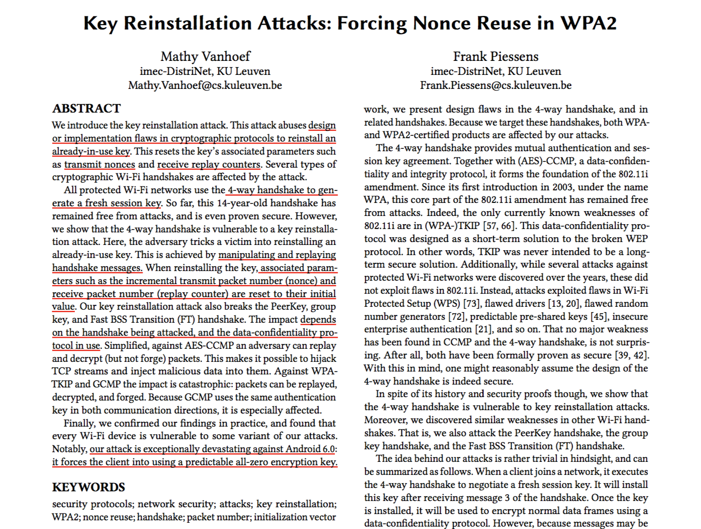
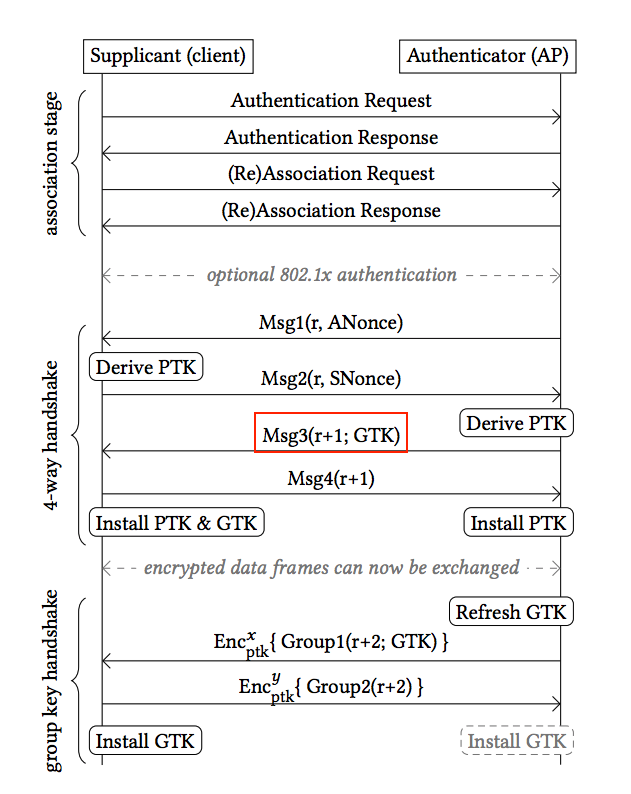

# Tekkiwartti

KRACK: Key Reinstallation Attacks

---

# So, what?

When: discoverd in 2016, notified vendors at July 14, 2017, publish in Public at Oct 16, 2017

Who: Mathy Vanhoef (Belgain Researcher)

What: protocol design flaw (WPA2 four-way handshakes) + software bug (linux based systems)

How: reinstall an already-in-use key by manipulating and replaying handshake messages

Target: Any device that uses Wi-Fi is likely vulnerable (mostly Linux, Android, and OpenBSD)

---

---

# Details

- WPA2 4-way handshake to negotiate a shared key with router

- Key + nonces are used for encrypting packets

- How it is used depends on the actual crypto algorithm being used

- Crypto attack if certain valuers are reused 

- KRACK: force reusing same values

- Software bug was found in some linux based systems 

- Key reset to all zero: 00000000000

---

- PTK: Pairwise Transient Key
- PTK is generated by concatenating PMK(password), AP nonce(ANonce), STA nonce(SNonce), AP MAC address, and STA MAC address.
---

# Bad News

- The attack works for both clients and access points

- Attacks against Android 6.0+ devices are very easy to accomplish

- Updates may never come for many IoT devices

- Change Wi-Fi password will not save you

---

# Good News

- Attacker must be within WiFi network range

- If you are using PC, You're already safe

---

# What you can do ?

1. Check with device vendor if the patch is available

2. Patch all the devices that are able to be patched: router, mobiles, laptop, IoT devices etc.

3. If patch is not available, replace wireless connections with either wired connections or cellular connection

4. Replace all devices that cannot be patched

5. Place devices on separate, restricted subnets/networks/VLANs and place devices on dedicated wireless networks; then, enforce different access controls per subnet

6. Always only visit website with HTTPS

---

### What I learn ?

- Curiosity, Critical thinking, source code reading

- How to prevent these types of bugs: "Need more rigorous inspections of protocol implementations"

---

# Firmware patch status (Last Update: Nov 1, 2017)

“We’re probably still going to find vulnerable devices 20 years from now”

Phones: 
- iOS:white_check_mark: iOS 11.1 (Just Release Oct 31, 2017)
- Android:warning: : Fixed at patch level "November 6, 2017." Rolls out soon to Pixel + Nexus
- Samsung:warning: : Modern Samsung devices receive Google security patches, but older ones don't. No comment on those

OS:
- macOS:white_check_mark: : macOS 10.11.1 (Just Release Oct 31, 2017)
- Windows:white_check_mark: : Windows 7, 8, 8.1, 10 (October 10th)
- Linux:white_check_mark: : Ubuntu 14.04+, Arch, OpenBSD, Debian, Gentoo, Linux upstream
- Raspberry Pi:white_check_mark: : sudo apt update && sudo apt upgrade

Router:
- Cisco:white_check_mark: : Updates available across Cisco hardware
- TP Link:warning: : The company doesn't know if it's affected
- Google WiFi:warning: : Google says a fix will roll out "soon"

IoT Devices:
- Amazon:warning: : "In the process of reviewing devices." No fix issued for Echo etc 
- IoT devices :sos: : probably patch will never reach them

https://www.kb.cert.org/vuls/byvendor?searchview&Query=FIELD+Reference=228519&SearchOrder=4
https://github.com/kristate/krackinfo

:white_check_mark: = Available for download and patched
:warning: = Fix pending release or in beta
:x: = No known fix
:sos: = Pray to god 

